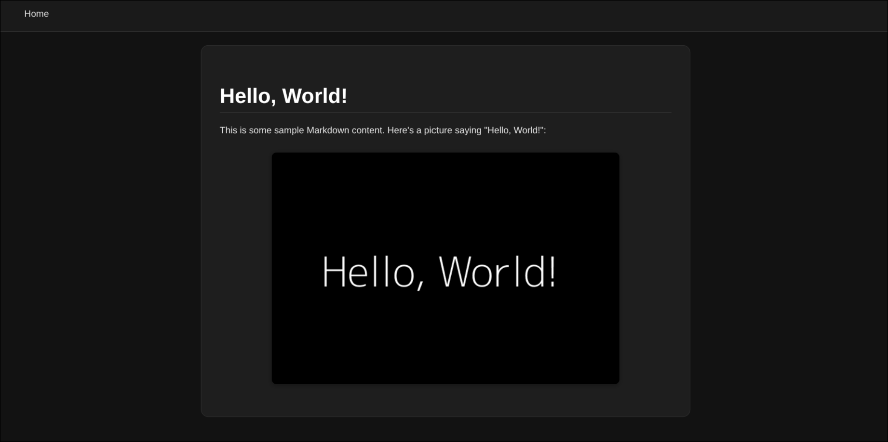

# Mark-rs

[](https://github.com/zliel/Mark-rs/actions/workflows/CI.yml)
[](https://github.com/zliel/Mark-rs/actions/workflows/publish.yml)
[](https://crates.io/crates/mark-rs)
[](https://zliel.github.io/Mark-rs/markrs/index.html)

Mark-rs is a 100% Commonmark-compliant Markdown parser and static site generator written in Rust.
It is designed to be fast, efficient, and easy to use.

## Table of Contents

<!--toc:start-->

- [Mark-rs](#mark-rs)
  - [Table of Contents](#table-of-contents)
  - [Features](#features)
  - [Installation (WIP)](#installation-wip)
  - [Usage](#usage)
    - [Options](#options)
  - [Configuration](#configuration)
  <!--toc:end-->

## Features

- Fast Markdown parsing
- HTML generation
- Custom configuration
- Easy-to-use CLI

## Preview

For the example input:

```markdown
# Hello, World

This is some sample Markdown content.
Here's a picture saying "Hello, World!":

```

The following HTML page will be generated:


## Installation (WIP)

To install Mark-rs, you need to have Rust installed on your system. You can install Rust using [rustup](https://rustup.rs/).

### Install via Cargo

Once you have Rust installed, you can install Mark-rs using Cargo:

```bash
cargo install mark-rs
```

### Install via Pre-built Binaries

You can also download pre-built binaries for your platform from the [releases page](https://github.com/zliel/Mark-rs/releases)

From there, you can download the appropriate binary for your operating system and architecture, extract it, and use it directly.

**Note**: Make sure to have the `~/.cargo/bin` directory in your `PATH` environment variable so you can run the `markrs` command from anywhere.

If it isn't already in your `PATH`, you can adding the following line to your shell configuration file (e.g., `~/.bashrc`, `~/.zshrc`, etc.):

```bash:
export PATH="$HOME/.cargo/bin:$PATH"
```

On Windows, you can add the `C:\Users\your_user\.cargo\bin` directory to your `PATH` environment variable.

## Usage

To use Mark-rs, you can run the following command in your terminal:

```bash
markrs [OPTIONS] <INPUT_DIR>
```

Where `<INPUT_DIR>` is the path to the directory of Markdown files you want to parse. The output will be written to `/output` by default.

### Options

You can also use the following CLI arguments to customize the behavior of Mark-rs:

- `-c, --config <CONFIG>`: Specify a custom configuration file (default: `./config.toml`).
- `-o, --output-dir <OUTPUT_DIR>`: Specify the output directory for the generated HTML files (default: `/output`).
- `-r, --recursive`: Recursively parse all Markdown files in the specified directory and its subdirectories. (default: false if not present)
- `-v, --verbose`: Enable verbose output, which will print additional information while the program is running.
- `-h, --help`: Display help information.
- `-V, --version`: Display the version of Mark-rs.

## Configuration

You can customize Mark-rs's behavior by specifying a config file to use. If a config file is not specified, then the default configuration directory will be checked; if no config file already exists, then the default `config.toml` file will be written.

The default configuration directories (defined by the [`dirs` crate](https://docs.rs/dirs/latest/dirs/) ) are:

| Platform | Value                                 | Example                                             |
| -------- | ------------------------------------- | --------------------------------------------------- |
| Linux    | `$XDG_CONFIG_HOME` or `$HOME`/.config | /home/your_user/.config/markrs                      |
| macOS    | `$HOME`/Library/Application Support   | /Users/your_user/Library/Application Support/markrs |
| Windows  | `{FOLDERID_RoamingAppData}`           | C:\Users\your_user\AppData\Roaming\markrs           |

Here is the default configuration:

```toml
# Tokenization
[lexer]
tab_size = 4

# HTML Generation
[html]
css_file = "default" # "default" for the default styles
favicon_file = ""    # Empty for no favicon
```
